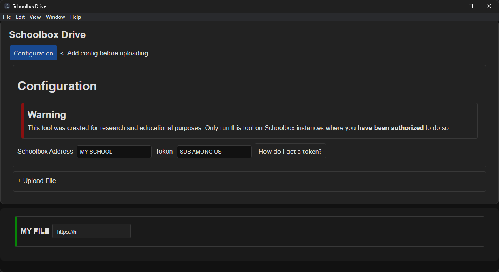

# SchoolboxDrive
Next-gen cloud storage solution in the comfort of your own schoolbox instance!

> **Warning**
> 
> This tool was created for ~~shits and giggles~~ research and educational purposes.
> Only run this tool on Schoolbox instances where you **have been authorized** to do so.

## Intro
Schoolbox has a generic endpoint where a file is uploaded, then later assigned a
purpose, e.g. to appear under a certain page. The latter step is however not required,
meaning you can simply upload a file and it will stay there indefinitely. This design flaw
hence makes it a perfect storage solution.

## Usage
Open configuration in the application then follow instructions.

## Credits
This project is based on https://github.com/Deluze/electron-vue-template
